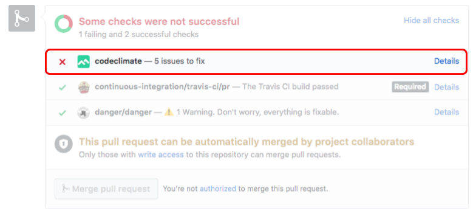
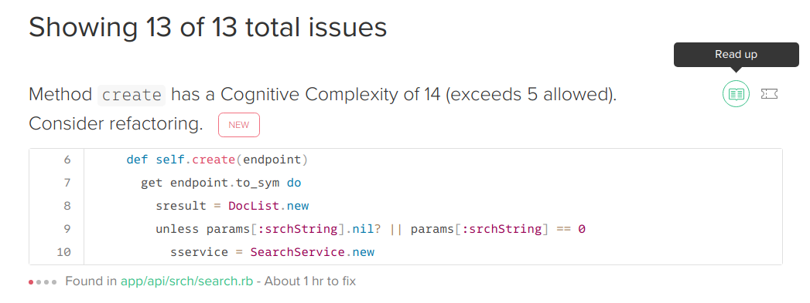
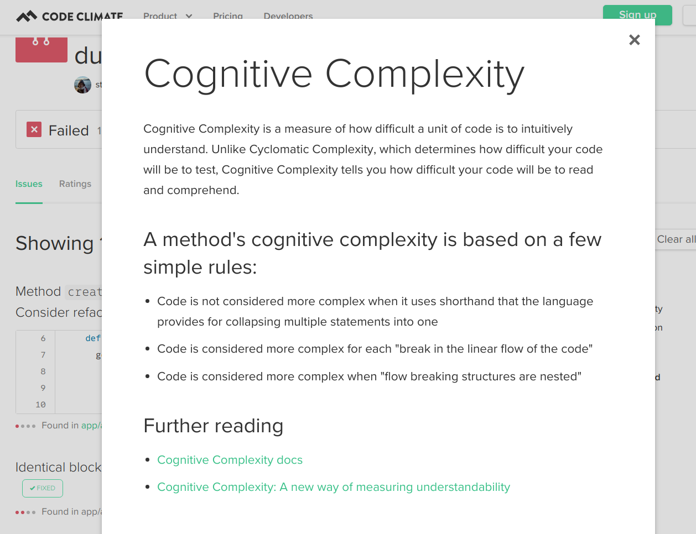

# Code Climate

We are implementing a [Code Climate](https://docs.codeclimate.com/docs) automation test to improve the quality of our code.

# Issues

CodeClimate is picky -- any time you think it's being too particular, you can ping @publiclab/reviewers and they can manually "approve" a PR and you can move forward -- not a problem! But if you click "details" next to CodeClimate, it'll offer some advice:

The most common is to refactor your code to avoid duplication or methods with
too many lines.

Below you can see CodeClimate complaining about "cognitive complexity" -- basically,
asking you to try to simplify how the code is written in order to make it more readable:

If you hover over the right-side of each issue, it has a "read more" link which offers some tips on how to resolve it:

CodeClimate is picky so if you have more questions or need help, you can always
ask for help.
