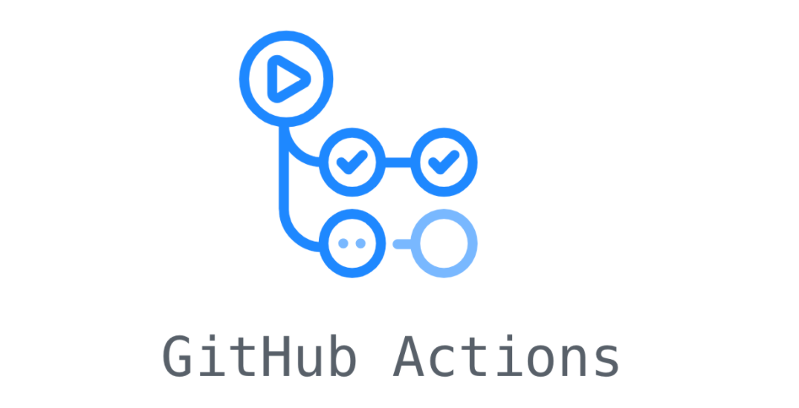

# Supporters

This page is dedicated to enumerating the various organizations that have provided tools for our open source software and community. They are all free for OSS!

## Thank you!

  <em><h3>For...</h3></em>

  <big>1. Hosting us</big>

  <big>2. Crash reporting</big>
  

  <big>3. Cross-browser and platform testing</big>

 

 

  <big>4. Automated testing</big>

 

  <big>5. Internationalization</big>

  

  <big>6. Code coverage reports</big>

 

 

  <big>7. Code quality analysis</big>

 

  <big>8. Project management</big>

  

  
  
  

